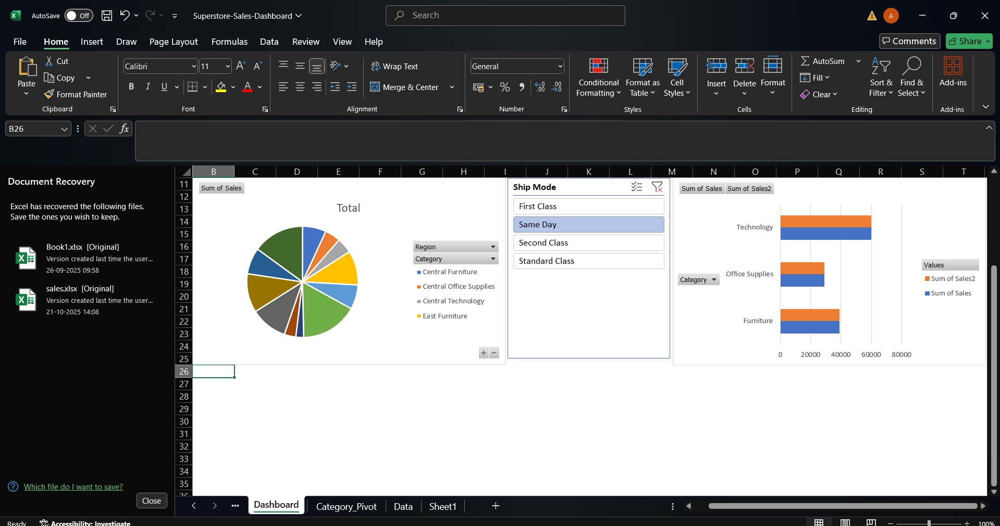

# Excel-Sales-Dashboard
# Excel Sales Dashboard for Superstore

This project involves cleaning, analyzing, and visualizing sales data from the "Sample Superstore" dataset. The goal was to build a user-friendly, interactive dashboard to answer key business questions.

---

## 🚀 Interactive Dashboard Demo

Here is the final dashboard in action. The slicers filter all charts simultaneously.

*(This is a static screenshot if you don't have a GIF)*

---

## 🛠️ Skills & Tools Used

* **Data Cleaning (Power Query):** Loaded the raw `.csv` file into Power Query to transform the data.
    * Checked and corrected data types (e.g., changed `Postal Code` from a number to text).
    * Removed unnecessary columns to optimize the model.
* **Data Analysis (Pivot Tables):** Created multiple pivot tables to answer key questions:
    * What are the total sales by region?
    * What are the total sales by product category?
* **Data Visualization (Dashboarding):**
    * Created **Pivot Charts** (Pie and Bar charts) from the pivot tables.
    * Arranged all charts onto a single "Dashboard" sheet.
    * Removed gridlines and formatted charts for a clean, professional look.
* **Interactivity (Slicers):**
    * Added a **Slicer** for "Ship Mode".
    * Used **"Report Connections"** to link the slicer to *both* pivot tables, allowing the entire dashboard to be filtered from one control.

## 📁 How to View the Project

You can download the full `Superstore-Sales-Dashboard.xlsx` file from this repository to interact with the dashboard and inspect the Power Query and Pivot Table setups.
